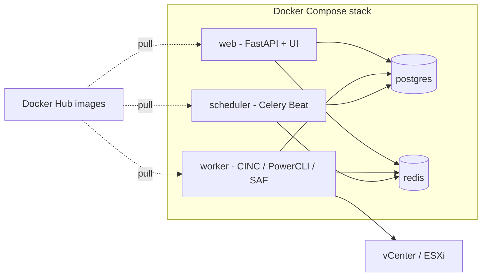

# Docker deployment guide

This document describes how to orchestrate the VMware STIG Tool stack with Docker Compose on a Linux host (RHEL 9, Ubuntu, etc.).

## Stack overview



| Service | Image | Role |
|---------|-------|------|
| `web` | `vmstigtool-web` | Web UI, REST API, Celery client |
| `worker` | `vmstigtool-worker` | Runs STIG scans (PowerCLI, CINC Auditor, SAF) |
| `scheduler` | `vmstigtool-scheduler` | Celery Beat for cron schedules |
| `postgres` | `postgres:16-alpine` | Application database |
| `redis` | `redis:7-alpine` | Celery broker |

## Compose files

| File | Purpose |
|------|---------|
| `docker-compose.yml` | Base stack (build + dev bind mounts + `--reload`) |
| `docker-compose.prod.yml` | Production: app code from image, no bind mounts |
| `docker-compose.hub.yml` | Pull pre-built images from Docker Hub (no local build) |
| `docker-compose.standalone.yml` | Use a local Docker network instead of external `Stigman` |
| `docker-compose.smb-export.example.yml` | Example CKL export to SMB share |

Combine files with multiple `-f` flags. Later files override earlier ones.

## Prerequisites

- Docker Engine 24+ with Compose plugin (`docker compose version`)
- Git
- Outbound internet (build or pull images, download STIG profiles)
- Network access from the **worker** container to vCenter on **443** (and **22** for VCSA appliance scans)

## 1. Clone from GitHub

```bash
git clone https://github.com/drummachine24/VMWare-STIG-Tool.git
cd VMWare-STIG-Tool
```

## 2. First-time host setup

```bash
bash scripts/first-time-setup.sh
```

This creates `.env` with encryption keys, data directories, and downloads STIG profiles into `stig-profiles/`.

Edit `.env` for your environment (OIDC, public URL, Docker Hub prefix, etc.). **Never commit `.env`.**

## 3. Choose a deployment mode

### A. Standalone (simplest — new install)

Creates a project-local Docker network. No shared STIG Manager network required.

```bash
docker compose -f docker-compose.yml -f docker-compose.prod.yml -f docker-compose.standalone.yml up --build -d
```

### B. Production build (bake app into images)

Use on your RHEL Docker host after `git pull`:

```bash
bash scripts/rebuild-on-server.sh --prod
```

Or manually:

```bash
docker compose -f docker-compose.yml -f docker-compose.prod.yml build web worker scheduler
docker compose -f docker-compose.yml -f docker-compose.prod.yml up -d --force-recreate web worker scheduler
```

### C. Deploy from Docker Hub (no local build)

After images are published to Docker Hub:

```bash
# In .env or shell:
export DOCKER_IMAGE_PREFIX=yourdockerhubuser/
export IMAGE_TAG=1.0.0

docker compose -f docker-compose.yml -f docker-compose.prod.yml -f docker-compose.hub.yml pull web worker scheduler
docker compose -f docker-compose.yml -f docker-compose.prod.yml -f docker-compose.hub.yml up -d
```

Add `-f docker-compose.standalone.yml` for a standalone network.

### D. Development (live code bind mount)

```bash
docker compose up --build -d
```

The `./backend/app` bind mount and uvicorn `--reload` let you edit code on the host without rebuilding.

### E. STIG Manager shared network

The base `docker-compose.yml` attaches services to an external Docker network named `Stigman` (for co-location with STIG Manager / Keycloak).

Create the network once if it does not exist:

```bash
docker network create Stigman
```

Then deploy without `docker-compose.standalone.yml`:

```bash
docker compose -f docker-compose.yml -f docker-compose.prod.yml up -d
```

See `deploy/nginx-vmstigtool.example.conf` for reverse-proxy configuration behind nginx.

## 4. Post-deploy steps

```bash
# Check containers
docker compose ps

# Health check
curl -s http://localhost:8081/health

# Install train-vmware plugin (required for real scans)
bash scripts/install-train-vmware.sh
```

## 5. Runtime volumes (not in images)

| Host path | Container path | Contents |
|-----------|----------------|----------|
| `./data/reports` | `/data/reports` | Scan JSON + CKL output |
| `./data/ckl-exports` | `/data/ckl-exports` | CKL export copies |
| `./data/secrets` | `/data/secrets` | Auto-generated app keys |
| `./stig-profiles` | `/usr/share/stigs` | VMware STIG profiles (read-only) |
| `./certs/dod-trust-combined.pem` | `/etc/ssl/certs/dod-trust.pem` | DoD CA bundle (optional) |

## 6. Environment variables

Key variables in `.env` (see `.env.example` for the full list):

| Variable | Purpose |
|----------|---------|
| `WEB_HOST_PORT` | Host port mapped to web container (default `8081`) |
| `CREDENTIAL_ENCRYPTION_KEY` | Fernet key for vCenter password encryption |
| `APP_SECRET_KEY` | Session signing key |
| `DOCKER_IMAGE_PREFIX` | Docker Hub namespace, e.g. `myuser/` |
| `IMAGE_TAG` | Image tag, e.g. `1.0.0` or `latest` |
| `APP_ROOT_PATH` | URL subpath when behind reverse proxy, e.g. `/vmstigtool` |
| `APP_PUBLIC_URL` | Public URL users open in the browser |
| `OIDC_*` | Keycloak / OIDC settings for production login |

## 7. Publishing images to Docker Hub

On a machine with Docker:

```bash
export DOCKER_IMAGE_PREFIX=yourdockerhubuser/
export IMAGE_TAG=1.0.0

docker login
bash scripts/publish-to-dockerhub.sh
```

Images published:

- `yourdockerhubuser/vmstigtool-web:tag`
- `yourdockerhubuser/vmstigtool-worker:tag`
- `yourdockerhubuser/vmstigtool-scheduler:tag`

## 8. Updating a running deployment

```bash
git pull
bash scripts/rebuild-on-server.sh --prod
```

Or with Docker Hub images:

```bash
export DOCKER_IMAGE_PREFIX=yourdockerhubuser/
export IMAGE_TAG=1.0.0

docker compose -f docker-compose.yml -f docker-compose.prod.yml -f docker-compose.hub.yml pull web worker scheduler
docker compose -f docker-compose.yml -f docker-compose.prod.yml -f docker-compose.hub.yml up -d --force-recreate web worker scheduler
```

## 9. Troubleshooting

| Issue | Fix |
|-------|-----|
| `set: pipefail: invalid option name` | Windows CRLF in shell scripts: `sed -i 's/\r$//' scripts/*.sh worker/install-scan-tools.sh` |
| `install-scan-tools.sh: not found` during worker build | Same CRLF issue; Dockerfile strips CRLF automatically in recent versions |
| `network Stigman declared as external, but could not be found` | `docker network create Stigman` or use `docker-compose.standalone.yml` |
| Docker Hub `push access denied` | Set `DOCKER_IMAGE_PREFIX=yourusername/` before build; run `docker login` |
| `tag does not exist` on push | Worker build failed — fix build errors first, then push |
| Profiles not found | Run `bash scripts/setup-stig-profiles.sh ./stig-profiles` |
| OIDC login fails | Match `APP_PUBLIC_URL`, `APP_ROOT_PATH`, and `OIDC_REDIRECT_URI` to your reverse proxy |

## 10. Quick reference

```bash
# Standalone production (build locally)
docker compose -f docker-compose.yml -f docker-compose.prod.yml -f docker-compose.standalone.yml up --build -d

# Production from Docker Hub
docker compose -f docker-compose.yml -f docker-compose.prod.yml -f docker-compose.hub.yml -f docker-compose.standalone.yml up -d

# Logs
docker compose logs -f web worker

# Shell into worker
docker compose exec worker bash
```
